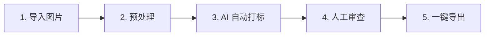

# Tag Master — AI LoRA 数据集打标与管理助手

**🌐 在线零配置体验:** [https://tera-dark.github.io/Tag-Master/](https://tera-dark.github.io/Tag-Master/)

---

**Tag Master** 是一款专为 AI 绘画模型微调（LoRA 训练、Checkpoints 微调）量身定制的**本地化数据集预处理与智能打标工具**。它致力于打通从“原始图片”到“标准 Kohya_ss 训练格式”的最后一公里，既为**新手炼丹师**提供拖拽即用的一站式极简工作流，也为**资深炼丹师**配备了比例锁定裁剪、智能标签清洗、高频标签点击搜索过滤等杀手级高阶管理功能。

---

## 🎯 懂行的炼丹师看这里：专业级核心特性

相比市面上臃肿或单一的打标工具，Tag Master 深度切中 LoRA 训练数据集整理中的各项痛点：

### 1. 🤖 Cherry Studio 风格通用模型服务中心 (Model Hub)
*   **全协议通用兼容**：同时支持原生 **Google Gemini** 与通用 **OpenAI Compatible 兼容接口**（SiliconFlow 硅基流动、OpenRouter、DeepSeek、Ollama、MintAPI、OneAPI 等任意第三方中转站）。
*   **自动化能力检测器 (Model Capability Detector)**：一键抓取 `/v1/models` 端点模型列表，内置智能启发式推断引擎，自动为 100+ 常见模型打上 6 维特性标签（`👁️ 视觉打标`、`💬 纯文本`、`⚡ 深度思考`、`🛠️ 工具`、`🎥 视频`、`🔊 音频`）。
*   **开箱即用一键切换**：按模型品牌家族分组折叠，支持按多模态能力快速筛选，一键设定反推打标模型，纯文本模型自带防呆友好提示。

### 2. 🪄 四大黄金反推模式 (Visual Prompt Compiler 2.0)
*   **Danbooru 纯标签模式 (Booru Tagging)**：按主体、服饰、构图、背景等严格规范输出逗号分隔的短标签，完美适配 Anime / SD1.5 / SDXL 训练。
*   **自然语言纯描述模式 (Natural Language)**：输出连贯流畅的高信息密度英文长句，对标 FLUX.1 / SD3.5 / Midjourney 的自然语言理解偏好。
*   **混合平衡模式 (Optimal Mixed - 推荐)**：前段保留核心概念与关键触发短标签，后段展开细致背景与环境光影描写，兼顾提示词灵活性与泛化性。
*   **主体聚焦模式 (Subject & Character Focus)**：深度聚焦角色外貌细节、特征服饰与微表情，剥离杂乱背景干扰，专门适配角色专属 LoRA。

### 3. 🖼️ 对标 Universal Extractor 的极简画廊工作台
*   **自适应长搜索框与快捷键**：加长舒展的搜索框（`min-w-[150px] max-w-[460px] flex-1`），配备 `/` 快捷键微徽标与全局快捷聚焦，按 `Esc` 失焦退出，支持一键清空。
*   **3 到 8 列数字药丸下拉菜单**：彻底淘汰易变形的 range 小滑块，提供极简的数字列数下拉选择卡片（3~8 列，默认 5 列），个性化设置安全持久化。
*   **无损完整展示 (Object Contain)**：图片缩略图全面采用 `object-contain` 模式，拒绝暴力裁切盲区，保证原图完整构图一览无遗。

### 4. 🗂️ 桌面级项目管理与 QoL 交互体系
*   **显眼的「+ 新建项目」**：项目列表头常驻新建药丸按钮与轻量弹窗，支持预设项目名与专属触发词。
*   **双击就地极速重命名 (Inline Rename)**：双击任意项目名直接变成输入框，`Enter` 立即保存；悬浮配备编辑与删除快捷操作。
*   **专属触发词微徽章绑定**：项目卡片直观呈现专属触发词标签（如 `🏷️ yan_zi_yao_yu`），打标时自动为对应图片注入。
*   **安全确认删除**：淘汰隐蔽易误触的浅灰叉号，弹出安全确认对话框，展示项目包含图片总数，彻底杜绝误删丢数据。
*   **桌面级右键菜单与单项目导出**：右键任意项目唤出操作浮层，支持一键将当前单一数据集独立打包为 Kohya 格式 ZIP。

### 5. 📏 比例锁定多尺寸预处理 (Locked Crop)
*   **训练分桶对齐**：内置 Lora 训练常用的分桶比例选项（`1:1` / `2:3` / `3:4` / `16:9` / `9:16` / `Free`），切换时裁剪框自动自适应。
*   **双向越界 Clamp 约束**：无论缩放还是平移裁剪框，裁剪框都绝对不会越界超出图像边缘，操作极其顺滑跟手。
*   **实时物理分辨率指示**：气泡实时呈现折算后的物理输出像素（如 `1024x1024 px`），所见即所得。
*   **拒绝图片模糊**：修复了传统前端裁剪 canvas 绘图尺寸不匹配导致导出图变糊的隐秘 bug，确保数据集 100% 原始高清解析度输出。

### 6. 🧹 智能一键标签清洗 (Tag Cleansing)
*   **内置四大黄金炼丹预设**：
    *   **全小写化 (Lowercase)**：将所有标签字符转为纯小写。
    *   **下划线转空格**：把 `long_hair` 一键转为 `long hair`（Kohya 自然语言训练常用）。
    *   **空格转下划线**：将各独立标签内空格转为 `_`（标准 Danbooru 规范）。
    *   **智能去重与整理**：剔除重复标签，自动清理连缀的逗号、空格以及首尾多余的分隔符。
*   **高阶 Regex 查找替换**：支持高级正则表达式替换规则，内置 **Live Test** 实时匹配预览及加粗亮绿变动提示。
*   **灵活的 Scope 控制**：所有规则和预设均支持独立应用至“已选 (Selected)”或“全部 (All)”图片，带防误触确认。

### 7. 🔍 高频标签交互过滤 (Top Tags Leaderboard)
*   **实时词频排行榜**：右侧 Inspector 面板实时统计当前项目排名前 12 位的高频标签词频。
*   **点击过滤多重检索**：点击词频排行榜中的任意标签，可自动将其填入或以逗号追加至顶部搜索框中，一键定位全部相关图片精准审查。

### 8. ⌨️ 全键盘高效标注工作流 (Keyboard Shortcuts)
*   **光标自动承接**：聚焦于 Caption 输入框时，直接按 `Alt + ◄/► (方向键)` 即可立即切换至前一张/下一张图片，并且**光标和聚焦会自动继承到新图片的输入框末尾**，实现零鼠标切换。
*   **列表智能平滑滚动**：未聚焦输入框时，直接按 `◄/►` 可在网格中切换选中焦点，卡片会自动平滑滚动 (`scrollIntoView`) 至可视区中央。

### 9. 🛡️ 智能速率限制与 429 挂机轮询 (Rate Limit & 429 Resilience)
*   **Google AI Studio 5 RPM / 15 RPM 保护预设**：针对免费层 5 次/分钟与 250k Token 限额，内置节奏节流平滑控制与并发锁定。
*   **429 自动排队轮询**：遭遇服务端资源耗尽（`RESOURCE_EXHAUSTED` / 429）时，自动解析服务端重试等待时间（`retryAfter`），全局进入倒计时等待，冷却结束自动恢复打标，告别频繁手动刷新。
*   **即时毫秒级暂停 (Instant Pause)**：调度器深度绑定 `AbortController` 与中断式休眠，点击暂停瞬间掐断所有在途连接，正在处理中的图片无缝回滚为待处理（`idle`）状态，不锁死界面、不破坏队列。

---

## 🎨 极简的五步可视化工作流

Tag Master 将繁琐的打标整理细分为清晰的 **五步流水线**，通过顶部的可视化步骤条引导你从零完成：



1.  **第一步：导入图片 (Import)**：直接将包含图片的文件夹（支持多层级嵌套）拖入页面，或通过新建项目分流管理。
2.  **第二步：预处理 (Preprocess)**：开启比例裁剪框，统一对每张图片进行快速缩放裁剪，确保主体视觉焦点突出。
3.  **第三步：AI 自动打标 (AI Tagging)**：选择配置好的多模态模型与反推模式，一键并发批量打标。
4.  **第四步：人工审查 (Review & Polish)**：利用全键盘快捷流与高频词排行榜进行审查精修，支持正则与预设批量清洗。
5.  **第五步：一键导出 (Export)**：支持按项目单独导出或全局导出为标准的 `图片 + .txt` 同名对 ZIP 压缩包，开箱即用。

---

## 🚀 本地运行与部署 (Quick Setup)

如果你需要使用本地大模型反代或更流畅的本地速度，建议将应用部署在本地运行：

### 1. 安装依赖
确保已安装 [Node.js](https://nodejs.org/) (推荐 v18 或更高版本)。在终端运行：
```bash
npm install
```

### 2. 预设 API 密钥 (可选)
在项目根目录下创建 `.env.local` 预设密钥（可在界面中随时修改）：
```env
VITE_GEMINI_API_KEY=your_gemini_api_key_here
```

### 3. 启动开发服务器
```bash
npm run dev
```
启动后在浏览器打开终端提示的地址（默认 `http://localhost:5173`）。

### 4. Windows 用户双击运行
你可以直接双击根目录下的 `start.bat` 一键安装并运行项目。

---

## 🛠️ 技术内幕与极致优化 (Under The Hood)

*   **Tree-shaking 瘦身 30%**：剥离了官方重型 SDK，重构为完全自研的兼容接口，使主 JS 产物体积从 **691.80 kB 暴减至 482.74 kB**，消除了打包警告，首屏毫秒级加载。
*   **IndexedDB 增量同步 (Incremental Sync)**：持久化存储采用 Immutable 对比机制，仅对引用改变（或新增/删除）的项目进行差异写入，**降低大图像文件序列化 I/O 开销 90% 以上**，避免大图片场景卡顿。
*   **预览图内存及时回收 (Memory Revocation)**：在任何删除、替换、裁剪更新逻辑中，严格执行 `URL.revokeObjectURL(previewUrl)` 回收系统底层内存，在大数据集处理时杜绝 OOM 崩溃。
*   **非阻塞 Vision 图像压缩**：发送 Vision 大模型请求前，采用 `createImageBitmap` + `OffscreenCanvas` 在后台线程完成解码和 JPEG 0.85 压缩（最大边限制为 1536px），消除主线程阻塞，UI 丝滑不卡顿。
*   **高内聚单一职责架构 (SRP Refactored)**：针对巨型组件全量解耦治理，将设置弹窗、主布局、预处理裁剪器及网络层全面拆解为 100~350 行的高内聚子模块，消除死代码与复杂依赖，提升维护性与工程健壮度。
*   **网络异常与超时精确隔离**：底层网络层严格区分用户主动暂停（`AbortController`）与网络环境超时（60s Timeout），当遇到跨域（CORS）或防火墙丢包时给出精准的诊断卡片与解决方案引导，杜绝静默失败。

---

## 🤝 贡献与开源许可

欢迎通过提交 Issue 或 Pull Request 来协助我们完善此项目！

*   **LICENSE**：MIT License
*   **技术栈**：React + TypeScript + Vite + TailwindCSS
