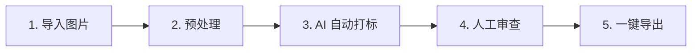

# Tag Master — AI LoRA 数据集打标与管理助手

**🌐 在线零配置体验:** [https://tera-dark.github.io/Tag-Master/](https://tera-dark.github.io/Tag-Master/)

---

**Tag Master** 是一款专为 AI 绘画模型微调（LoRA 训练、Checkpoints 微调）量身定制的**本地化数据集预处理与智能打标工具**。它致力于打通从“原始图片”到“标准 Kohya_ss 训练格式”的最后一公里，既为**新手炼丹师**提供拖拽即用的一站式极简工作流，也为**资深炼丹师**配备了比例锁定裁剪、智能标签清洗、高频标签点击搜索过滤等杀手级高阶管理功能。

---

## 🎯 懂行的炼丹师看这里：专业级核心特性

相比市面上臃肿或单一的打标工具，Tag Master 深度切中 LoRA 训练数据集整理中的各项痛点：

### 1. 📏 比例锁定多尺寸预处理 (Locked Crop)
*   **训练分桶对齐**：内置 Lora 训练常用的分桶比例选项（`1:1` / `2:3` / `3:4` / `16:9` / `9:16` / `Free`），切换时裁剪框自动自适应。
*   **双向越界 Clamp 约束**：无论缩放还是平移裁剪框，裁剪框都绝对不会越界超出图像边缘，操作极其顺滑跟手。
*   **实时物理分辨率指示**：气泡实时呈现折算后的物理输出像素（如 `1024x1024 px`），所见即所得。
*   **拒绝图片模糊**：修复了传统前端裁剪 canvas 绘图尺寸不匹配导致导出图变糊的隐秘 bug，确保数据集 100% 原始高清解析度输出。

### 2. 🧹 智能一键标签清洗 (Tag Cleansing)
*   **内置四大黄金炼丹预设**：
    *   **全小写化 (Lowercase)**：将所有标签字符转为纯小写。
    *   **下划线转空格**：把 `long_hair` 一键转为 `long hair`（Kohya 自然语言训练常用）。
    *   **空格转下划线**：将各独立标签内空格转为 `_`（标准 Danbooru 规范）。
    *   **智能去重与整理**：剔除重复标签，自动清理连缀的逗号、空格以及首尾多余的分隔符。
*   **高阶 Regex 查找替换**：支持高级正则表达式替换规则，内置 **Live Test** 实时匹配预览及加粗亮绿变动提示。
*   **灵活的 Scope 控制**：所有规则和预设均支持独立应用至“已选 (Selected)”或“全部 (All)”图片，带防误触确认。

### 3. 🔍 高频标签交互过滤 (Top Tags Leaderboard)
*   **实时词频排行榜**：右侧 Inspector 面板实时统计当前项目排名前 12 位的高频标签词频。
*   **点击过滤多重检索**：点击词频排行榜中的任意标签，可自动将其填入或以逗号追加至顶部搜索框中。这极大方便了炼丹师在发现某异常超频词时，一键定位全部相关图片进行精准审查与清洗。

### 4. ⌨️ 全键盘高效标注工作流 (Keyboard Shortcuts)
*   **光标自动承接**：聚焦于 Caption 输入框时，直接按 `Alt + ◄/► (方向键)` 即可立即切换至前一张/下一张图片，并且**光标和聚焦会自动继承到新图片的输入框末尾**，实现零键盘切换。
*   **列表智能平滑滚动**：未聚焦输入框时，直接按 `◄/►` 可在网格中切换选中焦点，卡片会自动平滑滚动 (`scrollIntoView`) 至可视区中央。

### 5. 🌐 大模型高可用连接层 (Smart API Proxy)
*   **智能动态反代 `smartFetch`**：当直连自建 API 中转（如 Ollama / One API / 局域网大模型）因 CORS 跨域限制失败或超时（15s），系统会自动 Fallback 切换至本地动态反代通道。
*   **限流退避与连续错误熔断**：API 遭遇 429 限流时采用指数退避算法自动等待重试；当遭遇连续 5 次报错时自动挂起批处理任务，杜绝盲目报红。

---

## 🎨 新手友好：极简的五步可视化工作流

Tag Master 将繁琐的打标整理细分为清晰的 **五步流水线**，通过顶部的可视化步骤条引导你从零完成：



1.  **第一步：导入图片 (Import)**
    *   **文件夹拖拽感应**：直接将包含图片的文件夹（支持多层级嵌套）拖入页面，系统会自动提取并将文件夹名称识别为独立的项目分组。
2.  **第二步：预处理 (Preprocess)**
    *   **比例裁剪**：开启 Crop 模式，使用常用比例对每张图片进行快速缩放裁剪，确保训练焦点完美突出。
3.  **第三步：AI 自动打标 (AI Tagging)**
    *   **三大主流提示词模板**：内置符合 2026 最新训练标准的 **Danbooru Tags (纯标签)**、**Natural Language (纯自然语言)** 和 **Optimal Mixed (双混合模式 - 推荐)**，支持多并发自动标注。
4.  **第四步：人工审查 (Review & Polish)**
    *   **快捷精修**：利用键盘快捷键和高频词排行榜对打标结果进行筛查，批量查找替换或手动微调 Caption。
5.  **第五步：一键导出 (Export)**
    *   **Kohya 格式一键打包**：直接导出为标准的 `图片 + .txt` 同名对，或直接下载压缩包，开箱即用。

---

## 🚀 本地运行与部署 (Quick Setup)

如果你需要使用本地大模型反代或更流畅的本地速度，建议将应用部署在本地运行：

### 1. 安装依赖
确保已安装 [Node.js](https://nodejs.org/) (推荐 v18 或更高版本)。在终端运行：
```bash
npm install
```

### 2. 预设 API 密钥 (可选)
在项目根目录下创建 `.env.local` 预设密钥（可在界面中随时修改）：
```env
VITE_GEMINI_API_KEY=your_gemini_api_key_here
```

### 3. 启动开发服务器
```bash
npm run dev
```
启动后在浏览器打开终端提示的地址（默认 `http://localhost:5173`）。

### 4. Windows 用户双击运行
你可以直接双击根目录下的 `start.bat` 一键安装并运行项目。

---

## 🛠️ 技术内幕与极致优化 (Under The Hood)

*   **Tree-shaking 瘦身 30%**：剥离了官方重型 SDK，重构为完全自研的兼容接口，使主 JS 产物体积从 **691.80 kB 暴减至 482.74 kB**，消除了打包警告，首屏毫秒级加载。
*   **IndexedDB 增量同步 (Incremental Sync)**：持久化存储采用 Immutable 对比机制，仅对引用改变（或新增/删除）的项目进行差异写入，**降低大图像文件序列化 I/O 开销 90% 以上**，避免大图片场景卡顿。
*   **预览图内存及时回收 (Memory Revocation)**：在任何删除、替换、裁剪更新逻辑中，严格执行 `URL.revokeObjectURL(previewUrl)` 回收系统底层内存，在大数据集处理时杜绝 OOM 崩溃。
*   **非阻塞 Vision 图像压缩**：发送 Vision 大模型请求前，采用 `createImageBitmap` + `OffscreenCanvas` 在后台线程完成解码和 JPEG 0.85 压缩（最大边限制为 1536px），消除主线程阻塞，UI 丝滑不卡顿。

---

## 🤝 贡献与开源许可

欢迎通过提交 Issue 或 Pull Request 来协助我们完善此项目！

*   **LICENSE**：MIT License
*   **技术栈**：React + TypeScript + Vite + TailwindCSS
