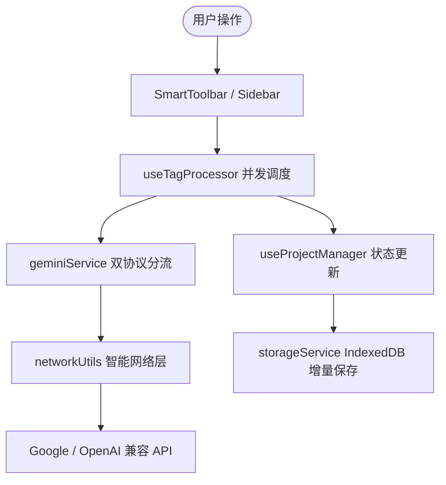

# Tag-Master 系统架构与技术实现指南 (Architecture Guide)

本文档面向后续维护者（人类开发者与 AI Agent），提供 Tag-Master 的整体软件架构、核心数据流、关键机制以及开发防雷指引。

---

## 1. 系统架构总览 (Architecture Overview)

Tag-Master 是一个纯前端运行、离线可用的 AI 数据集管理与打标应用，基于 React 19 + TypeScript + Vite + TailwindCSS v4 构建。

```
src/
├── components/          # UI 组件层（已全面单一职责解耦）
│   ├── layout/          # 主工作区布局 (Sidebar, SmartToolbar, Inspector)
│   ├── modals/          # 弹窗体系 (Export, BatchEdit, Move, LogModal, AddProviderModal)
│   │   └── settings/    # 设置中心 Tab (ModelSettingsTab, PromptSettingsTab, GeneralSettingsTab)
│   ├── workflow/        # 核心预处理与打标流水线 (CropEditor, PreprocessView, ReviewView)
│   └── ItemViews.tsx    # 网格卡片 (ImageCard) 与列表项 (ListItem)
├── hooks/               # 业务逻辑 Hook 层
│   ├── useProjectManager.ts    # 项目与图片增删改查、触发词管理
│   ├── useSelectionManager.ts  # 多选框选、范围选择、全选逻辑
│   ├── useSettings.ts          # 模型预设、列数与配置持久化
│   ├── useSearch.ts            # 多维度模糊搜索与状态筛选
│   └── useTagProcessor.ts      # 批量打标并发调度器、速率限制冷却、单张/批量隔离
├── services/            # 纯逻辑无状态服务层
│   ├── geminiService.ts        # Google / OpenAI 双协议 Payload 构造与 429 解析
│   ├── modelDetector.ts        # 端点模型自动探测与 6 维多模态能力推断
│   ├── loggerService.ts        # 内存运行日志追踪与实时诊断服务
│   ├── imageProcessor.ts       # OffscreenCanvas 非阻塞图像智能尺寸压缩
│   ├── networkUtils.ts         # 智能 Fetch 与可中断休眠 sleepWithSignal
│   ├── storageService.ts       # IndexedDB 增量差异化存储引擎
│   └── exportService.ts        # ZIP 打包与前缀触发词同名 txt 生成
└── types.ts             # 全局数据模型接口定义
```

---

## 2. 核心数据流与状态管理 (State Flow)



* **状态单一数据源**：`projects` 数组在 `useProjectManager` 中集中维护，通过不可变对象更新触发 React 重新渲染。
* **增量持久化**：`storageService.syncProjectsIncrementally(updated, deletedIds)` 借助 `prevProjectsRef` 引用对比，仅序列化发生实际变更的数据集，避免频繁 I/O 阻塞。

---

## 3. 关键机制深度解析 (Key Mechanisms)

### 3.1 速率限制与 429 自动轮询保护 (Rate Limit Resilience)
* **背景**：Google AI Studio 免费层限制为 5 次/分钟 (RPM) 及 250k Token/分钟 (TPM)。
* **流控设计**：
  * 设置中心提供 `google_5rpm`（固定 12s 安全间距）与 `google_15rpm`（4.5s 安全间距）节流预设；
  * 当服务商返回 HTTP 429 或 `RESOURCE_EXHAUSTED` 时，服务层抛出带有 `retryAfterSec` 的 `RateLimitError`；
  * `useTagProcessor` 捕获后，**绝不标记为红色 error，不递增连续错误计数**，而是将任务推回队首保持 `idle`，设置 `coolingUntilRef` 全局冷却时间戳；
  * 倒计时结束后无缝自动恢复继续打标，实现真正的免人工值守挂机。

### 3.2 即时毫秒级暂停 (Instant Pause with AbortController)
* **背景**：传统实现仅依靠状态标志位，遭遇网络阻塞或不可打断的 `setTimeout` 时会卡住数十秒。
* **实现**：
  * 批处理生命周期由 `activeAbortControllerRef` 贯穿；
  * 所有退避等待均使用 `sleepWithSignal(ms, signal)`；
  * 用户点击「暂停」时立即调用 `.abort()`，底层网络连接和定时器瞬间切断；
  * 正在处理中（`loading`）的图片立即回滚为 `idle` 并重回队列头部。

### 3.3 严格隔离用户暂停与网络超时 (Timeout Disambiguation)
* **设计准则**：
  * 请求超时由内部定时器（60s）触发；
  * 调度器判定是否退出 Worker，**必须严格检查 `userAbortSignal.aborted === true` 或 `shouldStopRef.current === true`**；
  * 内部网络超时错误转化为显式 `Error("请求超时 (60s)...")` 并标记在图片上，绝不能误判为用户暂停而导致批处理静默中断。

### 3.4 图像内存回收规范 (Memory Leak Prevention)
* 导入图片时通过 `URL.createObjectURL(file)` 创建瞬时预览链接；
* 在 `removeImages`、`deleteProject`、`clearDone` 或重新裁剪生成新图片时，**必须显式调用 `URL.revokeObjectURL(previewUrl)`** 释放系统内存，避免处理千张图片时浏览器崩溃。

### 3.5 单张重新生成与批量任务的生命周期隔离 (Single Regeneration & Batch Isolation)
* **设计背景**：批量打标采用队列 Worker 消费机制，使用 `shouldStopRef` 控制退出循环。若底层生成函数混入该标志，会导致批量暂停后，单张图片的重新生成被误判为中止并丢失标注状态。
* **隔离设计**：
  * `shouldStopRef` 仅控制批量 Worker 从 `queueRef` 中抽取新任务的循环控制；
  * 单张生成（`handleTagSingle`）直接调用底层生成函数，拥有专属的生命周期，不受批量状态影响；
  * **状态快照与无损回滚**：单张生成前保存 `previousStatus` 与 `previousCaption`，遇到未配置 Key 或异常中止时自动还原原有结果，保证成功状态（绿勾标）不丢失。

### 3.6 服务商管理与动态头像色彩架构 (Provider CRUD & Dynamic Avatar)
* **三层服务商模型**：
  * 官方系统预设（Google Gemini、OpenAI、SiliconFlow）带有 `isSystem: true`，全局保护防误删；
  * 第三方与自定义服务商支持完整的增、删、改、查；
* **色彩体系**：
  * 内置 13 款预设调色板与原生 1677 万色色彩拾取器；
  * 头像采用 Inline Style 渲染以稳定支持任意 Hex 颜色，并通过色彩亮度公式（`r*0.299 + g*0.587 + b*0.114`）自动计算并适配黑/白高对比度文字。

---

## 4. 常见开发红线与防踩坑清单 (Gotchas)

1. **避免在布局容器设置导致下拉裁剪的属性**：`SmartToolbar` 包含绝对定位菜单，容器必须使用 `overflow-visible`，严禁使用 `overflow-x-auto` 或 `overflow-hidden`。
2. **Hook 内部函数声明顺序**：在 `useCallback` 依赖中引用的函数必须在物理位置上先声明，避免 Vite 生产构建时因 TS2448 导致编译失败。
3. **网格列数保护**：列数由 `useSettings` 中的 `clampColumns` 限制在 3~8 列，严禁在 `window.onresize` 中重置用户的个性化列数。
4. **模型预设对齐**：Google 官方 Gemini API 模型代码严格为 `gemini-2.0-flash`、`gemini-2.0-flash-lite`、`gemini-1.5-flash`、`gemini-1.5-pro`，严禁随意虚构不存在的模型号。
